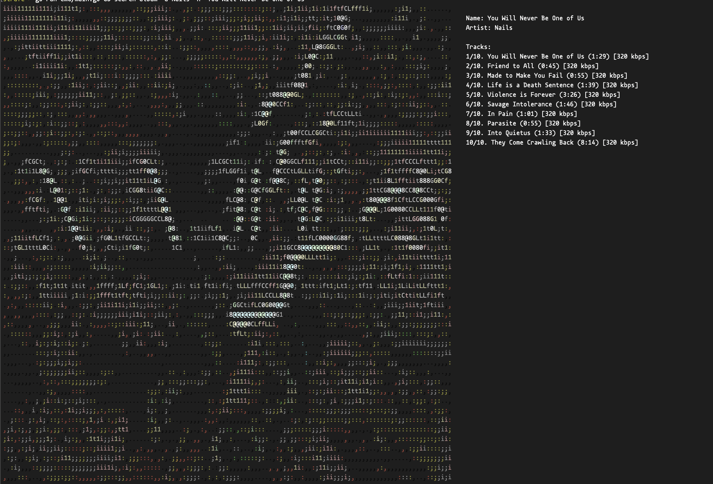

# Strafe
uploader cli and server for https://dj.cansu.dev

- [Strafe](#strafe)
  - [install](#install)
    - [uv](#uv)
    - [docker](#docker)
  - [run](#run)
    - [build yourself](#build-yourself)
    - [pre-built binary](#pre-built-binary)
    - [go](#go)
  - [usage](#usage)

wip

## install

**no dependencies required for server, only required for uploader**

### uv

<details>

<summary> uv </summary>

macos // linux
```bash
curl -LsSf https://astral.sh/uv/install.sh | sh
# inspect the script if you want to
curl -LsSf https://astral.sh/uv/install.sh | less
```
windows
```bash
powershell -ExecutionPolicy ByPass -c "irm https://astral.sh/uv/install.ps1 | iex"
# inspect the script if you want to
powershell -c "irm https://astral.sh/uv/install.ps1 | more"
```
if you dont want installation scripts just https://docs.astral.sh/uv/getting-started/installation/#installation-methods pick one, make sure `uv` binary is in path.


</details>

### docker

install anything that is compatible with Docker, I am using Orbstack on Mac, and the socket works fine. just make sure that `docker.socket` config leads to the correct path, such as `unix:///var/run/docker.sock`, `/Users/canercetin/.orbstack/run/docker.sock` etc.

## run

### build yourself

```bash
git clone https://github.com/caner-cetin/strafe.git
cd strafe
# if you want to build for your own system
just build-current
# will yield
# dist
# └── strafe
#
# if you want to build for all systems
just build
# will yield
# dist
# ├── strafe-darwin-amd64
# ├── strafe-darwin-arm64
# ├── strafe-linux-amd64
# ├── strafe-linux-arm64
# ├── strafe-windows-amd64.exe
# └── strafe-windows-arm64.exe
#
# if you want to do above but package 
just package
# will yield
# dist
# ├── strafe-darwin-amd64
# ├── strafe-darwin-amd64.tar.gz
# ├── strafe-darwin-arm64
# ├── strafe-darwin-arm64.tar.gz
# ├── strafe-linux-amd64
# ├── strafe-linux-amd64.tar.gz
# ├── strafe-linux-arm64
# ├── strafe-linux-arm64.tar.gz
# ├── strafe-windows-amd64.exe
# ├── strafe-windows-amd64.zip
# ├── strafe-windows-arm64.exe
# └── strafe-windows-arm64.zip
# deflates around 60-70%
```

### pre-built binary

https://github.com/caner-cetin/strafe/releases

same binaries / packages from `just package` command
```bash
# strafe-darwin-amd64
# strafe-darwin-amd64.tar.gz
# strafe-darwin-arm64
# strafe-darwin-arm64.tar.gz
# strafe-linux-amd64
# strafe-linux-amd64.tar.gz
# strafe-linux-arm64
# strafe-linux-arm64.tar.gz
# strafe-windows-amd64.exe
# strafe-windows-amd64.zip
# strafe-windows-arm64.exe
# strafe-windows-arm64.zip
```

### go
```bash
# im using this because of my lazy ass
go install github.com/caner-cetin/strafe@latest
# if this doesnt work
GOPROXY=direct go install github.com/caner-cetin/strafe@latest
strafe server -p 37550 -v > logs.txt &
```
## usage
fill the `.strafe.dummy.yaml`, rename to `.strafe.yaml` move it under your home directory

```bash
./strafe audio upload -i "Nails/2016 - You Will Never Be One of Us/01. You Will Never Be One of Us.mp3" -c folder.jpg
```
after the first track of album, cover art is not needed
```bash
./strafe audio upload -i "Nails/2016 - You Will Never Be One of Us/02. Friend to All.mp3"
```
keep going until entire album is uploaded, then
```bash
./strafe db search album -a Nails -n "You Will Never Be One of Us"
```



wip: folder uploads